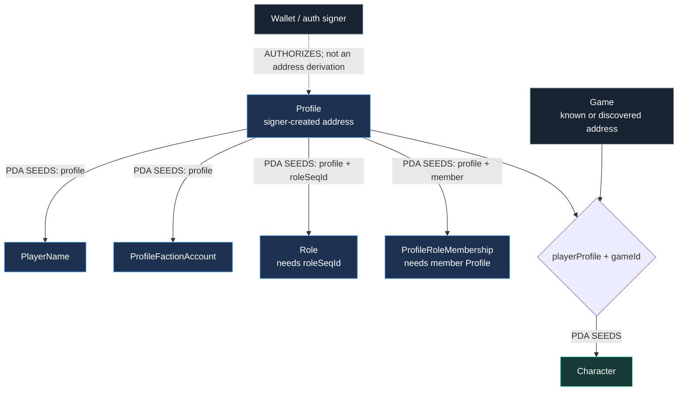
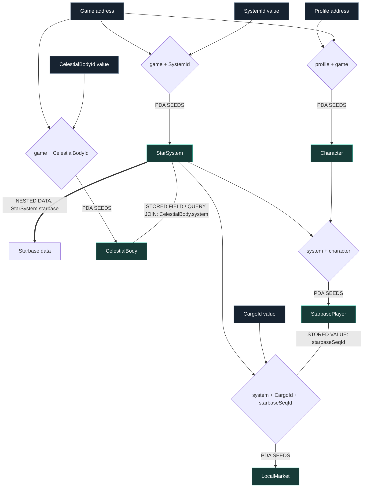
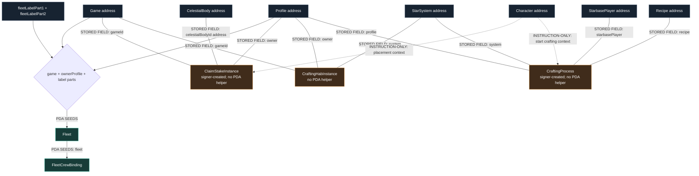

# Account Relationship Map

This page answers a practical question: **which address or seed value do I need
first to reach the next account?**

If the difference between a program, account, PDA, stored-field join, or
indexer is unfamiliar, read
[Programs, Accounts, and Terms](/sage-c4-bindings/concepts-and-terms) first.
The [Beginner Map](/sage-c4-bindings/beginner-map) shows the simplified
identity-to-gameplay hierarchy.

It is based on the generated sources in `@staratlas/dev-sage@0.52.0`,
`@staratlas/dev-player-profile@0.45.7`, and
`@staratlas/dev-profile-faction@0.45.7`. The map distinguishes four relationships
that are easy to conflate:

| Diagram relationship | Meaning |
| --- | --- |
| `PDA SEEDS` solid arrow | Every named seed is required by the generated `find…Pda` helper. |
| `STORED FIELD / QUERY JOIN` line | The source account stores a value that can be compared or used to filter discovered accounts. It does **not** derive the target. |
| `NESTED DATA` thick arrow | The value is decoded inside the parent account; it is not a separate program account. |
| `INSTRUCTION-ONLY` dotted arrow | Generated instruction metas use both accounts, but the audited account data does not store a durable link between them. |

::: warning Unofficial and version-pinned
These are client relationships, not a promise that an address exists on every
cluster. Validate program ownership, discriminator, and account data before
decoding. Re-audit the generated sources when package versions change.
:::

## Identity-to-gameplay resolution

A wallet does not determine a Profile address by itself. `createProfile` takes
the new Profile as a writable signer account, so applications must obtain the
Profile address from their own profile selection/discovery flow. Once the
Profile and SAGE `Game` addresses are known, the generated PDA chain becomes
deterministic.

Important consequences:

- `Profile.nextSeqId` helps choose the sequence id for a new `Role`, but a known
  role address still requires both `profile` and `roleSeqId`.
- `Profile.profileKeys` is nested authorization data, not a list of child
  Profile accounts.
- `ProfileFactionAccount.profile`, `PlayerName.profile`, `Role.profile`, and
  `ProfileRoleMembership.profile/member` are stored fields that corroborate the
  seed relationship after decoding.
- A SAGE `Character` is per `(playerProfile, gameId)`. It is neither the wallet
  nor the generic Profile.

## Player, world, and activity accounts

The focused graph below shows the common read path. Seed bundles are explicit
because two incoming arrows to an account should not be read as “either seed is
enough.”

`StarSystem.starbase` is an `Option<Starbase>` nested in the decoded
`StarSystem`; there is no standalone `Starbase` account or generated Starbase
PDA helper. Its surrounding `StarSystem.seqId` is stored as
`StarbasePlayer.seqId` and is the `starbaseSeqId` seed or field used by
`LocalMarket`, `FactionMarket`, and several process accounts.

### Activity discovery and instruction context

Fleet addresses are derivable only when the exact label seed bytes are known.
The other activity accounts below have no generated PDA helper, so their stored
fields are discovery joins rather than seed recipes.

## What to obtain first

| Goal | Start with | Then obtain or derive |
| --- | --- | --- |
| Display identity | Profile address | Derive `PlayerName` from `profile`; read `Profile.profileKeys` directly. |
| Read faction | Profile address | Derive `ProfileFactionAccount` from `profile`. |
| Read progression | Profile address + Game address | Derive `Character` from `playerProfile + gameId`. |
| Read one star system | Game address + `SystemId` | Derive `StarSystem`; decode its nested `starbase` and `seqId`. |
| Read player state at a starbase | StarSystem address + Character address | Derive `StarbasePlayer`. |
| Read a known fleet | Game address + owner Profile + exact two 32-byte label parts | Derive `Fleet`, then derive `FleetCrewBinding` from the Fleet address. |
| Find fleets when the label is unknown | Game address and/or owner Profile | Discover Fleet accounts by discriminator and stable stored-field prefixes, then decode. |
| Read a local market | StarSystem address + `CargoId` + `StarSystem.seqId` | Derive `LocalMarket`. |
| Read claim stakes, habs, jobs, quests, missions, loot, or upgrade processes | Known account address, transaction result, indexer, or program-account discovery | Decode and join through their stored fields; there is no generated PDA helper for these accounts. |

## Complete generated PDA seed index

Use the generated helper instead of manually encoding its fixed string prefix.
The table lists the caller-supplied seed fields exactly as generated.

### Player Profile and Profile Faction

| Account / helper | Caller-supplied seeds |
| --- | --- |
| `PlayerName` / `findPlayerNamePda` | `profile` |
| `Role` / `findRolePda` | `profile`, `roleSeqId` |
| `ProfileRoleMembership` / `findProfileRoleMembershipPda` | `profile`, `member` |
| `ProfileFactionAccount` / `findProfileFactionAccountPda` | `profile` |

`Profile` itself has no PDA helper. The generated `createProfile` instruction
requires the Profile to be a transaction signer.

### SAGE player and world

| Account | Caller-supplied seeds |
| --- | --- |
| `Character` | `playerProfile`, `gameId` |
| `CrewRoster` | `character`, `pageIndex` |
| `Fleet` | `gameId`, `ownerProfile`, `fleetLabelPart1`, `fleetLabelPart2` |
| `FleetCrewBinding` | `fleet` |
| `StarSystem` | `gameId`, `systemId` |
| `CelestialBody` | `game`, `id` |
| `StarbasePlayer` | `system`, `character` |
| `LocalMarket` | `system`, `cargoId`, `starbaseSeqId` |
| `Recipe` | `gameId`, `recipeId` |
| `ScanPattern` | `gameId`, `scanPatternId` |
| `CargoDefinitionsCache` | `gameId` |
| `CurrencyConfigCache` | `gameId` |

### SAGE regions, encounters, and missions

| Account | Caller-supplied seeds |
| --- | --- |
| `RegionTracker` | `gameId` |
| `RegionOrderAnchor` | `gameId`, `regionId` |
| `RegionBorderUpload` | `gameId`, `regionId` |
| `ScanPatternNoiseMapUpload` | `gameId`, `scanPatternId` |
| `ShipDefinitionUpload` | `gameId`, `shipId` |
| `EncounterCommit` | `gameId`, `character` |
| `EncounterPool` | `gameId`, `regionId`, `minorFaction` |
| `EncounterTreasury` | `gameId`, `regionId`, `minorFaction` |
| `EphemeralMarket` | `gameId`, `ownerCharacter` |
| `MissionTreasury` | `gameId`, `regionId` |
| `MissionStakeVault` | `mission` |

### SAGE factions, loyalty, and rewards

| Account | Caller-supplied seeds |
| --- | --- |
| `FactionAccount` | `gameId`, `factionId` |
| `FactionConfig` | `gameId` |
| `FactionEconomicsConfig` | `gameId` |
| `FactionEpochMeter` | `gameId`, `factionId` |
| `FactionMarket` | `gameId`, `system`, `starbaseSeqId` |
| `FactionOwnership` | `gameId`, `assetKind`, `assetKey` |
| `FactionRelationTracker` | `gameId` |
| `FactionStanding` | `gameId`, `profile`, `factionId` |
| `FactionTreasury` | `gameId`, `factionId` |
| `KingSystemTracker` | `gameId` |
| `OutlawFlag` | `profile`, `faction` |
| `LoyaltyAtlasBank` | `gameId`, `profile`, `factionId` |
| `LoyaltyContribution` | `gameId`, `profile`, `factionId`, `epochIndex` |
| `LoyaltyEpoch` | `gameId`, `factionId`, `epochIndex` |
| `AtlasRewardConfig` | `gameId`, `configVersion` |
| `AtlasRewardRegistry` | `gameId` |
| `AtlasRewardTreasury` | `gameId` |

## Accounts that require discovery or a supplied address

The generated SAGE client has 48 account decoders and 40 PDA helpers. These
eight SAGE accounts have no generated PDA helper:

| Account | Useful durable fields for joining after discovery |
| --- | --- |
| `Game` | `profile` is the stored game/config profile, not the current player's Profile. |
| `ClaimStakeInstance` | `owner`, `gameId`, `celestialBodyId` (an address), definition ids, `systemSeqId`. |
| `CraftingHabInstance` | `owner`, `gameId`, `system`, definition ids, `systemSeqId`. |
| `CraftingProcess` | `recipe`, `profile`, `system`, `starbasePlayer`, `craftingHab`. |
| `Loot` | `gameId`, `profile`, coordinates and reward metadata. |
| `MissionProcess` | `profile`, `starbasePlayer`, `rewardPool`, region and template ids. |
| `QuestProcess` | `profile`, `starbasePlayer`, `starbaseSeqId`. |
| `StarbaseUpgradeProcess` | `profile`, `system`, `starbasePlayer`, `starbaseSeqId`, `resourceId`. |

The absence of a generated PDA helper is actionable information: do not invent
seeds from field names. Use a known address, the creating transaction result,
an indexer, or `getProgramAccounts` filtered by discriminator and verified
fixed-prefix fields.

## Stored links versus instruction context

Generated instructions frequently bring together accounts that do not retain
each other's addresses. For example:

- `placeClaimStakeInstanceWithHub` takes Profile validation, Profile Faction,
  Claim Stake, Star System, Starbase Player, Celestial Body, Character, and
  Currency Cache accounts. The resulting Claim Stake stores owner/game/body
  links, but not Character, Profile Faction, Currency Cache, or Starbase Player
  addresses.
- `startCraftingProcess` takes Profile validation, Character, Game, Star
  System, Starbase Player, Recipe, the signer-created Crafting Process, and
  optional Hab/Currency/Crew Binding accounts. `CraftingProcess` stores the
  recipe/profile/system/starbase-player/hab links, but not Character, Game,
  Currency Cache, or Crew Binding addresses.

Treat those omitted relationships as transaction context, not foreign keys.
This matters for indexer schemas: instruction history can answer “which accounts
participated together,” while decoded account state answers “which relationship
is durable now.”
