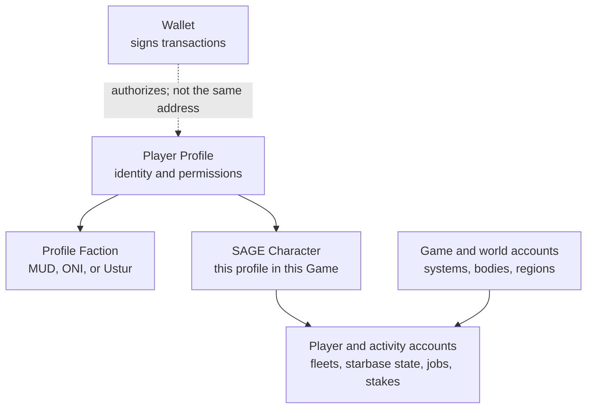

# Beginner Map

This section is for developers who are new to Star Atlas Golden Era (SAGE),
new to z.ink/Solana development, or both. C4 is the current SAGE release label.

The short version: the TypeScript packages let you read and build instructions
for Star Atlas programs on z.ink. SAGE C4 is browser strategy gameplay where
fleets, resources, crafting, territory, and faction identity settle into
on-chain state. Before you send anything, learn the nouns.

## Where your code sits

The generated Star Atlas packages are bindings. A binding turns raw program
data into TypeScript values and turns typed inputs into transaction
instructions.

```txt
your app
  -> generated Star Atlas binding
  -> @solana/kit
  -> z.ink RPC
  -> on-chain program and accounts
```

The binding does not contain the SAGE game rules and does not find every
account automatically. It only knows the account layouts, address recipes,
instruction formats, and errors generated from a particular program version.

## The big picture



A wallet is the key that can sign. A profile is the Star Atlas identity. A faction account says which side that profile belongs to. SAGE accounts describe the game world: fleets, starbases, cargo, crafting, movement, combat, and other gameplay systems.

A SAGE `Character` is the bridge between generic Star Atlas identity and one
specific SAGE `Game`. World and activity accounts then connect that character
to systems, starbases, fleets, crafting jobs, claim stakes, markets, and other
gameplay.

The arrows do not all mean “derive this address.” Some accounts are PDAs, some
store a related address as data, some are nested inside another account, and
some only meet inside an instruction. The
[Account Relationship Map](/sage-c4-bindings/account-relationship-map)
distinguishes those cases precisely.

## Words you will see everywhere

### Remote Procedure Call (RPC)

An RPC endpoint is the URL your code talks to when it reads z.ink account data
or sends transactions.

For the SAGE C4 Public Test Realm (PTR), use:

```txt
https://testnet-rpc.z.ink
```

### Program

A z.ink/Solana program is on-chain code. In these docs, the important programs
are SAGE, Player Profile, and Profile Faction.

### Account

A z.ink/Solana account stores data. A SAGE fleet, a player profile, and a
profile's faction are all accounts.

### Address

An address identifies a program or account. It looks like a long base58 string.

### Program Derived Address (PDA)

A PDA is an account address calculated from known inputs, called seeds.

For example, a profile's faction account can be derived from the profile address. You do not have to search the whole chain if you already know the profile.

### Fetch helper

The generated packages include functions like `fetchMaybeProfile` and `fetchMaybeFleet`. These read and decode accounts for you.

Prefer `fetchMaybe...` while exploring because missing accounts become a normal `exists: false` result instead of an exception.

### Instruction

An instruction asks a z.ink/Solana program to do something. Reading an account
is harmless. Sending an instruction can change game state, move assets, spend
tokens, or require a wallet signature.

Start with read-only examples before building instructions that change state.

### Binding

A binding is generated application code for one program. It gives TypeScript
names to accounts, fields, instructions, errors, enums, and PDA helpers. In
this site, “generated client” and “binding” refer to that same layer.

### Discriminator

A discriminator is the short byte prefix that identifies an account type or
instruction type. It lets code distinguish, for example, a `Fleet` account
from a `Game` account before decoding the rest of the data.

### Indexer

An indexer reads chain data and organizes it for faster application queries.
Generated bindings can decode an address you already have, but an indexer or a
filtered program-account query is often how an application discovers all
accounts belonging to a player, game, or domain.

## First path through the docs

Read these pages in order:

1. [Installation](/sage-c4-bindings/installation)
2. [Connection setup](/sage-c4-bindings/connection)
3. [`@solana/kit` client](/sage-c4-bindings/kit-client)
4. [Reading live game state](/sage-c4-bindings/reading-game-state)
5. [Read identity and faction](/sage-c4-bindings/read-identity-and-faction)
6. [SAGE gameplay overview](/sage-c4-bindings/sage-gameplay-overview)

After that, the reference-style pages will make much more sense.

## Safety rule

Reading is fine. Signing is serious.

Before asking a wallet to sign, explain:

- which program is being called
- which account will change
- which wallet or profile authority is required
- whether assets, cargo, tokens, or fleet state can move
- how to simulate before sending
