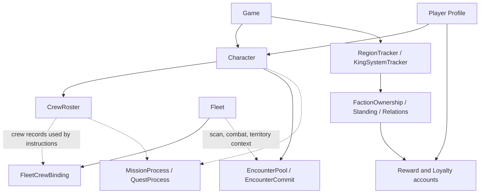

# Extended C4 Systems

The core guides focus on identity, world data, fleets, cargo, crafting, claim
stakes, markets, mining, and scanning. The current Star Atlas Golden Era
(SAGE) C4 binding also exposes newer account families for crew, territory,
encounters, rewards, missions, and quests.

This page places those families in the account hierarchy without pretending
that generated names alone define a complete player-facing workflow. Treat it
as a map to the binding surface; use current C4 behavior, simulation, and
before/after account inspection before publishing a send flow.

## How the systems connect

Some arrows above represent instruction context or stored relationships, not
Program Derived Address (PDA) derivation. Use the
[Account Relationship Map](/sage-c4-bindings/account-relationship-map) for the
exact generated seeds.

## Crew, rosters, and perks

Crew is a gameplay resource used by fleets, crafting, claim stakes, starbase
work, quests, and progression. The binding separates bulk character-owned crew
records from per-fleet assignment state.

::: info Position in the account hierarchy
**`CrewRoster`:** one paged roster derived from Character + page index 
**`FleetCrewBinding`:** derived from Fleet 
**Related player state:** Character and StarbasePlayer 
**Related instructions:** `bindCrew`, `unbindCrew`, roster load/unload, experience point (XP) awards, level-up, migration, garrison, perk, and research builders
:::

Important generated anchors:

- accounts: `CrewRoster`, `FleetCrewBinding`
- PDA helpers: `findCrewRosterPda`, `findFleetCrewBindingPda`
- instructions: `bindCrew`, `unbindCrew`, `loadFleetCrewRoster`,
  `unloadFleetCrewRoster`, `awardCrewActivityXp`, `levelUpCrew`,
  `markCrewGarrison`, `unlockPerk`, `respecPerks`

Do not reduce crew to a numeric count. Assignment, roster page, availability,
XP, perks, and the activity consuming the crew can all matter to a review
screen.

## Factions, territory, and control

Profile Faction records a major faction choice. SAGE's faction accounts go
further: they model dynamic controllers, relations, standing, economics,
markets, treasuries, contested windows, region ordering, and King System
state.

::: info Position in the account hierarchy
**Root:** Game 
**Map context:** RegionTracker, StarSystem, nested Starbase, KingSystemTracker 
**Control state:** FactionOwnership sidecars for assets such as starbases, fleets, or regions 
**Relationship state:** FactionRelationTracker, FactionStanding, and faction configuration/economics accounts 
**Player impact:** movement access, combat context, market access, loyalty, and territory yield
:::

Important generated anchors:

- accounts: `FactionAccount`, `FactionConfig`, `FactionOwnership`,
  `FactionRelationTracker`, `FactionStanding`, `FactionEconomicsConfig`,
  `FactionMarket`, `FactionTreasury`, `KingSystemTracker`,
  `RegionOrderAnchor`, `OutlawFlag`
- instructions: `setFactionRelation`, `transferFactionOwnership`,
  `setContested`, `reconcileKingSystem`, `claimTerritoryYield`,
  `declareOutlaw`, `clearOutlaw`, `tradeFactionMarket`

This is distinct from the
[Profile Faction](/sage-c4-bindings/profile-faction) program. Profile Faction
answers which major faction a profile chose; SAGE faction accounts describe
the evolving strategic state inside the game.

## Encounters, combat, and loot

Combat and encounters connect a Fleet and Character to region/faction context,
reward configuration, treasuries, and Loot state.

`EncounterCommit` is a per-character tracker for a pending encounter armed by
a scan. It records the triggering Fleet, region, location, commit slot, and
minor-faction context. `EncounterPool` supplies encounter configuration for a
region and faction.

Important generated anchors:

- accounts: `EncounterPool`, `EncounterCommit`, `EncounterTreasury`,
  `EphemeralMarket`, `Loot`, `OutlawFlag`
- instructions: `openEncounterTracking`, `scan`, `revealEncounter`,
  `tradeEncounter`, `attackFleet`, `attackStarbase`,
  `resolveCombatRewards`, `sweepExpiredCombatRewardLoot`

The [Scanning Workflow](/sage-c4-bindings/scanning-workflow) already shows the
optional encounter accounts used when a scan arms this state. A future
end-to-end encounter guide should begin from a verified live trace rather than
inferring the flow solely from builder names.

## Rewards, loyalty, and ATLAS

Reward accounts separate configuration and treasury state from per-profile
contributions and settlement.

::: info Position in the account hierarchy
**Configuration:** AtlasRewardRegistry and AtlasRewardConfig 
**Funding:** AtlasRewardTreasury, FactionTreasury, LoyaltyAtlasBank 
**Epoch state:** reward and loyalty epoch accounts 
**Player/faction state:** LoyaltyContribution scoped by Game, Profile, faction, and epoch 
**Outputs:** Loyalty Points and ATLAS entitlement/settlement
:::

Important generated anchors:

- accounts: `AtlasRewardRegistry`, `AtlasRewardConfig`,
  `AtlasRewardTreasury`, `LoyaltyEpoch`, `LoyaltyContribution`,
  `LoyaltyAtlasBank`, `FactionEpochMeter`
- instructions: `rollAtlasRewardEpoch`, `advanceAtlasRewardEpoch`,
  `settleLoyaltyContribution`, `claimLoyaltyAtlas`, reward-treasury funding
  and cleanup builders

Generated fields expose current state, not the complete reward policy. A UI
should show the active epoch, faction, contribution, entitlement,
denomination, settlement state, and treasury source before presenting a claim.

## Missions and quests

`MissionProcess` and `QuestProcess` are activity accounts, not static mission
catalogs.

- `MissionProcess` records profile and starbase context, committed crew,
  timing, stake, reward routing, success parameters, and eventual outcome.
- `QuestProcess` records profile and StarbasePlayer context, crew allocation,
  reward roster page, XP, and start/end times.

Neither account currently has a generated PDA helper. Obtain process addresses
from the creating transaction, application state, an indexer, or
discriminator-filtered account discovery.

Important generated instructions include `startMission`, `armMissionSettle`,
`settleMission`, `abortMission`, `startQuest`, `completeQuest`, and
`cancelQuest`.

Before documenting these as runnable workflows, verify:

- where the player selects the mission or quest
- which off-chain catalog or UI data supplies its configuration
- which account is newly created
- what crew, cargo, ATLAS, or time is committed
- how reward and failure outcomes are settled
- which accounts are writable at each phase

## Research and council progression

Research and perk definitions are primarily configuration nested in or related
to Game and Character state. Player-facing instructions include
`unlockResearchNode`, `unlockPerk`, `respecPerks`, and daily check-in and XP
flows.

Start with [Character and Progression](/sage-c4-bindings/character-progression)
for the player-specific account. Treat research definitions, requirements, XP
budgets, and unlock state as separate concerns when adapting them into an
application model.

## Verification boundary

The account and instruction names on this page were checked against
`@staratlas/dev-sage@0.52.0`. They establish the technical surface and
relationship questions. They do not establish that every flow is currently
enabled in the public PTR or that a generated instruction is safe to send.
