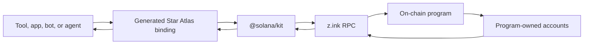

# Star Atlas Golden Era (SAGE) C4 Developer Docs

SAGE C4 is a major expansion and update of the Star Atlas strategy game,
available in the browser at `https://sage.staratlas.com` and currently running
on the z.ink testnet. C4 is the release label used throughout these docs.

This section focuses on developer integration: what to import, which cluster
to use, how to decode on-chain game state safely, and how to structure calls
so results remain easy to verify.

If you are new to z.ink/Solana development or SAGE, start with the [Beginner Map](/sage-c4-bindings/beginner-map). It explains the basic nouns before the code samples start using them.

## What these bindings are

The packages in these docs are generated TypeScript bindings for three
on-chain programs. They translate between application code and the binary
addresses, account data, and instructions understood by those programs.



The bindings provide:

- account decoders and typed fetch helpers
- Program Derived Address (PDA) helpers for accounts with known seeds
- instruction builders with ordered account metadata
- generated enums, codecs, parsers, and error definitions

They do **not** discover every account, hold wallet keys, explain game policy,
or decide whether a transaction is safe. Discovery may require known
addresses, PDA seeds, program-account queries, transaction history, or an
indexer. Signing and sending remain application responsibilities.

See [Programs, Accounts, and Terms](/sage-c4-bindings/concepts-and-terms) for
the vocabulary used throughout the site.

## Star Atlas context

SAGE is a browser-based explore, expand, exploit, and exterminate (4X) strategy game where actions such as movement, mining,
crafting, and transport settle on z.ink, and resources power fleet operations,
crafting, trading, and starbase upkeep.

Useful official starting points:

- [What is SAGE Labs Starbased?](https://support.staratlas.com/hc/en-us/articles/47061430667027-What-is-Sage-Labs-Starbased)
- [What Are Resources in Star Atlas?](https://support.staratlas.com/hc/en-us/articles/47061415287571-What-Are-Resources-in-Star-Atlas)
- [Star Atlas Build APIs and Data](https://build.staratlas.com/dev-resources/apis-and-data)

## Current Public Test Realm (PTR) endpoints

| Purpose | Endpoint |
| --- | --- |
| HTTP Remote Procedure Call (RPC) | `https://testnet-rpc.z.ink` |
| WebSocket RPC | `wss://testnet-rpc.z.ink` |
| Explorer | `https://explorer.z.ink` |

## Suggested layout

```txt
src/
  clients/
    sage-c4.ts
  clusters/
    sage-ptr.ts
  scripts/
    inspect-sector.ts
  types/
    sage.ts
```

## Baseline client shape

```ts
import { createSolanaRpc, createSolanaRpcSubscriptions } from '@solana/kit';

export const sagePtr = {
	rpc: createSolanaRpc('https://testnet-rpc.z.ink'),
	subscriptions: createSolanaRpcSubscriptions('wss://testnet-rpc.z.ink')
};
```

::: tip
Keep the endpoint explicit in early integration code while the PTR is moving.
Hidden global cluster configuration is convenient later, but makes initial
debugging harder.
:::

## Reading paths

If you are new to the game, the programs, or generated bindings:

1. [Beginner Map](/sage-c4-bindings/beginner-map)
2. [Installation](/sage-c4-bindings/installation)
3. [`@solana/kit` client](/sage-c4-bindings/kit-client)
4. [Reading Live Game State](/sage-c4-bindings/reading-game-state)
5. [SAGE Gameplay Overview](/sage-c4-bindings/sage-gameplay-overview)

If you are building a tool:

1. [Connection setup](/sage-c4-bindings/connection)
2. [`@solana/kit` client](/sage-c4-bindings/kit-client)
3. [Transaction Review and Account Diffs](/sage-c4-bindings/transaction-review-and-diffs)
4. The relevant domain page: [Fleets](/sage-c4-bindings/fleets), [Cargo and Currency](/sage-c4-bindings/cargo-and-currency), [Crafting](/sage-c4-bindings/crafting), [Claim Stakes](/sage-c4-bindings/claim-stakes), [Mining, Scanning, and Loot](/sage-c4-bindings/mining-scanning-loot), [Starbases](/sage-c4-bindings/starbases), [World Data](/sage-c4-bindings/world-data), or [Local Markets](/sage-c4-bindings/local-markets).
5. The matching workflow page when the action creates or mutates state.

If you need exact generated-client details:

1. [Account decoding](/sage-c4-bindings/accounts)
2. [Program Architecture](/sage-c4-bindings/program-architecture)
3. [Current Package Surface](/sage-c4-bindings/current-package-surface)
4. [Generated Types Glossary](/sage-c4-bindings/generated-types-glossary)
5. The relevant domain and workflow pages for live PTR behavior.
